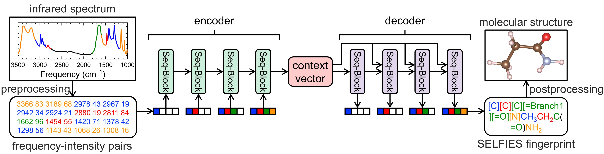

# Seq2Seq-IR
 [](https://opensource.org/licenses/MIT)
 [](https://github.com/Lin-Group-at-UMass/Seq2Seq-IR/graphs/contributors/)
 [](https://slsa.dev)

**[Revolutionizing Spectroscopic Analysis Using Sequence-to-Sequence Models I: From Infrared Spectra to Molecular Structures](https://doi.org/10.26434/chemrxiv-2025-n4q84)**\
_Ethan J. French, Xianqi Deng, Siqi Chen, Cheng-Wei Ju, Xi Cheng, Lijun Zhang, Xiao Liu, Hui Guan, and Zhou Lin_

<p align="center">

</p>

---
## Language
For English, see [README.en.md](README.md) \
para español, consulte [README.es.md](README.es.md)  
中文版, 请参见 [README.zh.md](README.zh.md)

---

## Abstract

<p align="justify">
Infrared (IR) spectroscopy reveals molecular and material features via their characteristic vibrational frequencies in an efficient and sensitive style and has thus become one of the most popular analytical tools in broad areas involving chemical discovery. These fields include material synthesis, drug design, pharmacokinetics, safety screening, pollutant sensing, and observational astronomy. However, in situ molecular or material identification from spectral signals remains a resource-intensive challenge and requires professional training due to its complexity in tracking effects to causes. Motivated by the recent success of sequence-to-sequence (Seq2Seq) models from deep learning, we developed a direct, accurate, effortless and physics-informed protocol to realize such a in-situ spectrum-to-structure translation, and provided the proof-of-concept of our models using IR spectra. We expressed both the input IR spectrum and the output molecular structure as alphanumerical sequences, treated them as two sentences describing the same molecule from two different languages, and translated them into each other using Seq2Seq models from recurrent neural networks (RNNs) and Transformers. Trained and validated using a curated data set of 198,091 organic molecules from the QM9 and PC9 databases, our Seq2Seq models achieved state-of-the-art accuracy of up to 0.611, 0.850, 0.804, and > 0.972 in generating target molecular identities, chemical formulas, structural frameworks, and functional groups from only IR spectra. Our study sets the stage for a revolutionary way to analyze molecular or material spectra by replacing human labor with rapid and accurate deep learning approaches.
</p>

---

## Installation
```bash
conda create -n ir python=3.12
conda activate ir
cd Spectrum2Structure/
# pip install pip==24.0
pip install -r requirements.txt
```
#### Note: Please keep ```pip ≤ 24.0```, if your ```pip > 24.0``` that can't download ```pytorch_lightning == 1.6.3```. If you download ```pytorch_lightning != 1.6.3```, please change the ```'gpus'``` setting of trainer in ```train.py```.
---

## Data
The data is available on Figshare at: [10.6084/m9.figshare.28754678](https://doi.org/10.6084/m9.figshare.28754678) 

The data should then be saved to the data directory
```bash
# download or copy data to this default directory
cd Spectrum2Structure/data
```
---
## Model Availability

The pre-trained models can be obtained via PyTorch Hub
```python
model = torch.hub.load('pytorch/vision', 'resnet18', pretrained=True)
```
or via FigShare at: [10.6084/m9.figshare.28795676](https://doi.org/10.6084/m9.figshare.28795676)

then save the model weights to the checkpoints directory
```bash
cd Spectrum2Structure/
mkdir checkpoints
cd checkpoints/
# download or copy model weight to this default directory
unzip smiles_checkpoints.zip
```

Others - Google Drive

Seq2Seq Models - SELFIES Format
* [LSTM-SELFIES](https://drive.google.com/file/d/18h9KhxCqPs8dqfkvVkXmlpzUHZcvXVG3/view?usp=drive_link)
* [GRU-SELFIES](https://drive.google.com/file/d/1yvieeRp4zAPLxwbEXy2r_y-KKDQtpuoE/view?usp=drive_link)
* [GPT-SELFIES](https://drive.google.com/file/d/1aZ4LimRDZQdO6-nbl2L7pFX_1tf7bcb5/view?usp=drive_link)
* [Transformer-SELFIES](https://drive.google.com/file/d/1GEKui9gihHuNBLjL39D7RFfIPul5FBBf/view?usp=drive_link)

Seq2Seq Models - Mixture Molecule
* [LSTM-Mixture](https://drive.google.com/file/d/1SR_eywrGnizKsq3pj90MIOsoJUXYmXyi/view?usp=drive_link)
* [GRU-Mixture](https://drive.google.com/file/d/1gnLu4cNLegIQ_VY02NHMEHdprG7vvooN/view?usp=drive_link)
* [GPT-Mixture](https://drive.google.com/file/d/1MEW_AM3cALkOGscMi5OxXYdUKQECDlny/view?usp=drive_link)
* [Transformer-Mixture](https://drive.google.com/file/d/1BvmMF_TV3AM2rN7n5v-x8-M_gF-I_PMk/view?usp=drive_link)

Seq2Seq Models - SMILES Format
* [SMILES_Checkpoints](https://drive.google.com/file/d/1OHjNAwHIZGW89V9PlxsNk0SL0lJaL5hw/view?usp=drive_link)

#### Note: Since the Transformer model utilizes Batch Normalization for spectra data, please ensure that the batch size is set to 256 when using any Transformer-based model weights.

---

## Usage
### Model Training

Available models for different datasets

SELFIES  Format   Dataset: ```lstm```, ```gru```, ```gpt```, ```transformer```

Mixture  Molecule Dataset: ```lstm-mixture```, ```gru-mixture ```, ```gpt-mixture```, ```transformer-mixture```

SMILES   Format   Dataset: ```lstm-smiles```, ```gru-smiles```, ```gpt-smiles```, ```transformer-smiles```

```bash
cd Spectrum2Structure/
chmod +x run_train.sh
./run_train.sh <model>
```

Or you can train the model with custom settings:
```bash
cd Spectrum2Structure/
python train.py --model <model> --mode <mode> \
    --hidden_dim <hidden_dim> --dropout <dropout> --layers <layers> --heads <heads> \
    --batch_size <batch_size> --max_epochs <max_epochs> --lr <lr> --weight_decay <weight_decay>
    --use_gpu <use_gpu> --calculate_prediction <calculate_prediction>
```

Optional arguments:
```bash
--model                Model architecture: LSTM, GRU, GPT, Transformer       (default: Transformer)
--mode                 Choose encoding mode: selfies, smiles, or mixture     (default: selfies)
--hidden_dim           size of input hidden units                            (default: 768)
--dropout              dropout probability                                   (default: 0.1)
--layers               number of hidden layers                               (default: 6)
--heads                number of attention heads                             (default: 6)
--batch_size           Batch size for training                               (default: 256)
--max_epochs           number of epochs to train                             (default: 80)
--lr                   initial learning rate                                 (default: 1e-4)
--weight_decay         weight decay coefficient                              (default: 1e-5)
--use_gpu              Whether to use GPU for training                       (default: True)
--calculate_prediction whether to calculate prediction                       (default: True)
--seed                 Random seed for reproducibility                       (default: 78438379)
```

#### Example
Training Transformer model by SMILES format dataset:
```bash
cd Spectrum2Structure/
chmod +x run_train.sh
./run_train.sh transformer-smiles
```

Custom settings:
```bash
cd Spectrum2Structure/
python train.py --model Transformer --mode smiles \
    --hidden_dim 768 --dropout 0.1 --layers 6 --heads 6 \
    --batch_size 256 --max_epochs 95 --lr 1e-4 --weight_decay 1e-5 \
    --use_gpu True --calculate_prediction True
```

### Model Evaluation

Available tasks for different datasets

SELFIES  Format   Dataset: ```eval```, ```generation```, ```topk```

Mixture  Molecule Dataset: ```eval```, ```generation```

SMILES   Format   Dataset: ```eval```

```bash
cd Spectrum2Structure/
chmod +x run_test.sh
./run_test.sh <model> <checkpoint> <mode> [output_file]
```

Or you can test the model with custom settings.
```bash
cd Spectrum2Structure/
python test.py --model <model> --mode <mode> --task <task> \
    --checkpoints <checkpoints> --batch_size <batch_size> \
    --use_gpu <use_gpu> --output_file <output_file>
```

Optional arguments:
```bash
--mode            Choose encoding mode: selfies, smiles, or mixture          (default: selfies)
--task            Task type: evaluation, generation, or top‑k prediction     (default: eval)
--model           Model architecture: LSTM, GRU, GPT, Transformer            (default: Transformer)
--checkpoints     Path to model checkpoint (required)                                   
--batch_size      Batch size for testing                                     (default: 256)
--use_gpu         Whether to use GPU for inference                           (default: True)
--seed            Random seed for reproducibility                            (default: 78438379)
--output_file     Custom output file name (optional)                         (default: None)
```

#### Example
Get Transformer model Topk resutls:
```bash
cd Spectrum2Structure/
chmod +x run_test.sh
./run_test.sh transformer checkpoints/Transformer-epoch=96-step=30070.ckpt topk
```

Custom settings:
```bash
cd Spectrum2Structure/
python test.py --model Transformer --mode selfies --task topk \
    --checkpoints checkpoints/Transformer-epoch=96-step=30070.ckpt --batch_size 256 --use_gpu True
```

---

## Questions, Comments, or Concerns?

For anything code related, please open an issue. Otherwise, please open a discussion tab.

---

## Citation

If you find this model and code are useful in your work, please cite:
```bibtex
@article{french2025revolutionizing,
  title={Revolutionizing Spectroscopic Analysis Using Sequence-to-Sequence Models I: From Infrared Spectra to Molecular Structures},
  author={French, Ethan and Deng, Xianqi and Chen, Siqi and Ju, Cheng-Wei and Cheng, Xi and Zhang, Lijun and Liu, Xiao and Guan, Hui and Lin, Zhou},
  journal={ChemRxiv preprint doi:10.26434/chemrxiv-2025-n4q84},
  year={2025}
}
```

---

## Acknowledgements

H.G. and Z.L. acknowledge the financial support from from the University of Massachusetts
Amherst under their Start-Up Funds and the ADVANCE Collaborative Grant. All au-
thors acknowledge UMass/URI Unity Cluster and MIT SuperCloud for providing high-
performance computing (HPC) resources.
